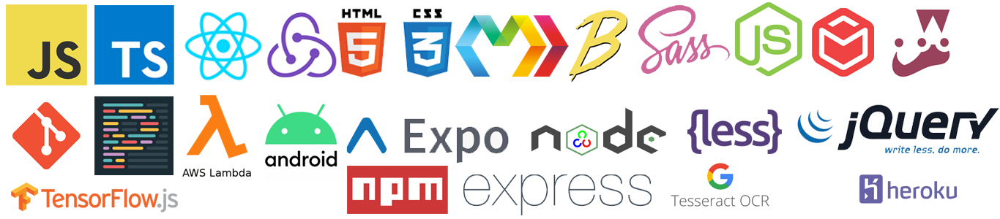

### Hi there 👋

My name is **Sandeep**. I am from **INDIA**. I am a **Computer Engineer** with **6+ years of experience** in building software systems across areas like **Ecommerce**, **Social Networking**, **Signal Processing**, **Multimedia processing**, **Blockchain**, **Fintech** etc. I predominantly work and contribute in **Front End engineering**. I am also an **avid contributor to various opensource projects** and maintains my own set of projects as listed below and available from npm. I am also a **member of Ebay opensource** team for **MarkoJs**.

I love working on the following technologies:

